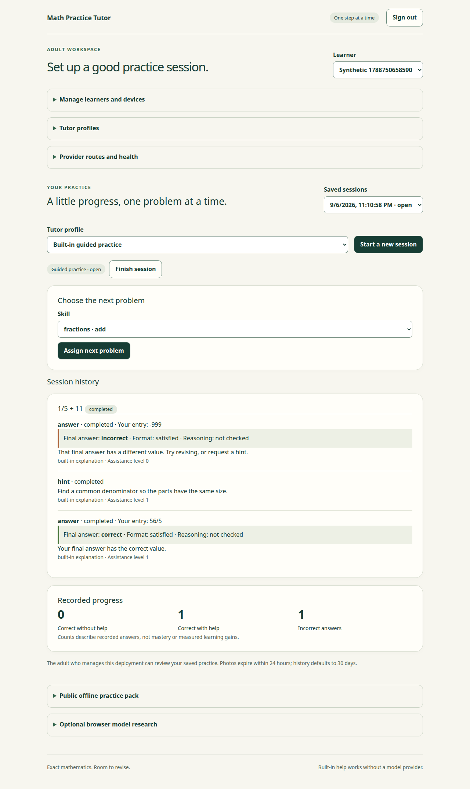
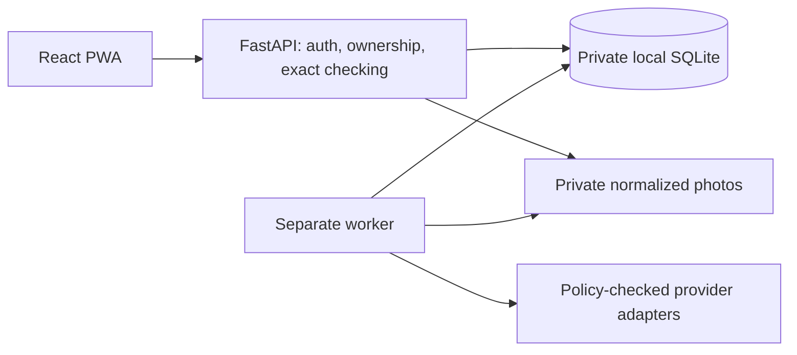

# Math Practice Tutor

A self-hosted math practice PWA for one household. Practice fractions and linear
equations, enter an answer and optional steps, ask questions, or submit a photo.
Exact rational arithmetic checks supported answers. Photos require confirmation;
model responses cannot change grades, permissions, or progress.

The repository now includes the T03–T23 implementations. Automated evidence and
remaining release gates are recorded in [TASKS](docs/TASKS.md) and
[ACCEPTANCE](docs/ACCEPTANCE.md). Live model quality, real phone camera/install
checks, and browser model device measurements remain unverified. They require the
maintainer's devices/accounts and were explicitly deferred. This is not a claim
of production readiness or educational effectiveness.

## Try the synthetic demo

Prerequisites: Git, GNU Make, Node **24.20.0**, pnpm **12.3.4**, and uv
**0.12.10**. Python **3.14.7** is installed by uv if needed. See
[dependency decisions](docs/DEPENDENCIES.md).

```bash
make bootstrap
make demo
```

Open <http://127.0.0.1:8000>. Sign in as `demo` with
`synthetic-demo-password-only`. This public credential belongs only to the
isolated, temporary demo database. Select Orbit or Delta, start a session, and
assign a problem. Ctrl+C stops both services and deletes the disposable database.
Demo mode accepts numeric answers and authored help, blocks free-text work,
photos, and live providers, and never reads private operator configuration.

## Set up private practice

```bash
make setup
set -a
. ./.env
set +a
make db
make migrate
make admin
make dev
```

`make setup` creates a private `.env` with an absolute SQLite path and a random
session secret; it refuses to read or overwrite an existing file. Export its
values in each new shell. Never share that file with coding agents. `make admin`
accepts the password through a hidden interactive prompt. Password reset revokes
that administrator's sessions.

`make dev` builds and serves the UI, API, and worker at the configured loopback
origin (default <http://127.0.0.1:8000>). Select/create a learner in the adult
workspace. On a second browser, choose **Pair this device**, copy its request ID
to the adult workspace, and approve the selected learner. Pairing expires after
five minutes and is bound to the requesting browser. Learners can access only
their own practice; adults can review managed learners' history.

The default mock vision route does not read handwriting: it exercises confirmation
by asking you to type the transcription and final answer. Built-in hints and
exact checking work without any model. Configure live routes using
[providers.example.yaml](config/providers.example.yaml) and follow
[PROVIDER_STATUS](docs/PROVIDER_STATUS.md) before using them.

This is a pre-production hard cutover: recreate disposable databases from earlier
revisions. Do not apply these corrected initial migrations to data you intend to
retain. [RUNBOOK](docs/RUNBOOK.md) covers private HTTPS, containers, EC2/EBS,
retention, encrypted backups, and restore rehearsals.



## Behavior and boundaries

- Seven supported skills: fraction addition, subtraction, multiplication,
  division, simplification, equivalence, and `a*x+b=c` equations.
- Separate answer, format, and reasoning status. Reasoning is explicitly **not
  checked**; correct final answers do not certify intermediate work.
- Versioned profiles, progressively requested help, session history, bounded
  progress counts, authenticated exports, and deletion with recovery tombstones.
- Durable jobs survive API reloads and worker crashes. Duplicate requests produce
  one visible result. A crash after a provider response may require a second
  billed request; total calls remain bounded.
- Photos are normalized privately, metadata removed, and deleted within 24 hours.
  History defaults to 30 days. Retention runs in the worker.
- Public offline exercises check exact values locally and never sync or count as
  saved server progress. Service-worker caches contain public assets only.
- Optional external-problem photos always remain **unverifiable**. Optional
  browser model research requires explicit download consent, uses synthetic text
  only, and has no access to tutoring grades or saved work.



Run one API process and one worker on the same host and local disk. No network
filesystem, horizontal scaling, autonomous model tools, or silent cloud fallback.
Provider keys and answer keys stay on the backend.

## Commands and verification

The [Makefile](Makefile) is authoritative.

| Command | Purpose |
|---|---|
| `make bootstrap`, `make hooks-install` | Locked install and local commit checks |
| `make check` | Locks, lint, format, strict types, unit/component tests, builds, generated contracts, secret scan, IaC lint |
| `make test-integration` | On-disk migration, authorization, recovery, provider-policy and retention checks |
| `make smoke` / `make test-e2e` | Isolated API/worker and desktop/mobile Chromium workflows |
| `make eval-mock` | Original deterministic fixtures and mock vision contracts; no quality claim |
| `make audit`, `make hooks-check` | Locked dependency vulnerability audit and tracked-file checks |
| `make contracts` / `make contracts-check` | Regenerate OpenAPI/TypeScript or reject drift |
| `make format`, `make lint`, `make typecheck` | Focused developer checks |
| `make demo`, `make seed-demo` | Disposable supervisor, or explicit empty demo database seed |
| `make dev`, `make worker` | Native foreground services, or worker alone |
| `make down` | Stop Compose services while retaining data; native services use Ctrl+C |
| `make backup OUTPUT=...`, `make restore INPUT=... OUTPUT=... LEDGER=...` | Interactive encrypted backup/restore with writes stopped |
| `make eval-live PROVIDER=...` | Explicit opt-in, at most three synthetic tutor calls; requires configured route |

Install the test browser with `pnpm exec playwright install --with-deps chromium`,
or set `PLAYWRIGHT_CHROMIUM_EXECUTABLE_PATH` to an installed Chrome. Mobile
emulation does not certify actual Safari/Chrome phone behavior. Restricted tools
can use `UV_CACHE_DIR=/tmp/...` and `PNPM='pnpm --store-dir /tmp/...'`.

CI also builds and smoke-tests the non-root container, scans HIGH/CRITICAL image
vulnerabilities, and generates an SBOM. It does not provision, publish a service,
or invoke live inference. The task log distinguishes observed runs from configured
checks. Review public staged files; never blanket-add local configuration or data.

## Contributing and license

Read [AGENTS](AGENTS.md), the [specification](docs/SPECIFICATION.md), and the
[current handoff](docs/HANDOFF.md). Use original synthetic fixtures and record
actual outcomes. See [THREAT_MODEL](docs/THREAT_MODEL.md) for boundaries and
[evals/MANIFEST](evals/MANIFEST.md) for provenance. Implementation was AI-assisted;
software tests and human review provide the evidence, not model self-assessment.

[MIT licensed](LICENSE), as approved by the maintainer. Dependencies, model
weights, and third-party runtime artifacts retain their own licenses.
