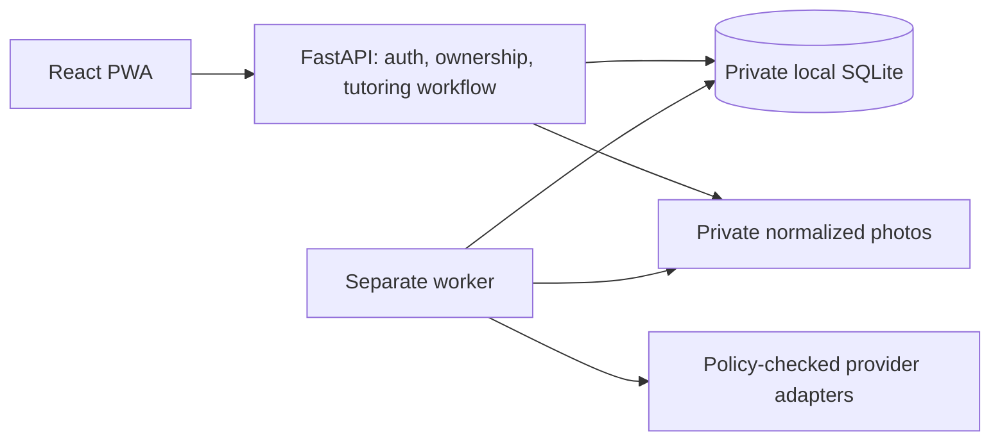

# Shepard Academy Universe

A self-hosted AI tutor: choose a topic, receive an activity, work on paper, send
an iPhone photo, and get guidance on your actual work. Revise or discuss it, then
receive a next activity informed by the conversation. Use math, writing, reading,
history, social studies, science, or your own topic—no required grade level or
fixed-template catalog.

The AI reads the work automatically and shows its reading before the feedback.
Clear readings proceed without an approval step. Unclear handwriting or layout
gets specific improvement advice and a request for a cleaner submission.

Uploaded or pasted homework is **reference material, not a request for answers**.
The tutor generates different practice on related concepts and guides with
explanations and relevant examples. It does not complete the original assignment
or supply the active task's final answer. Tutor initiative is adjustable.

The T25 correction replaces the earlier math-checker-first experience. Evidence and
remaining release gates are recorded in [TASKS](docs/TASKS.md) and
[ACCEPTANCE](docs/ACCEPTANCE.md). Live model quality, real phone camera/install
checks, and browser model device measurements remain unverified. They require the
maintainer's devices/accounts and were explicitly deferred. This is not a claim
of production readiness or educational effectiveness.

## Run it on your computer

Prerequisites: Git, GNU Make, Node **24.20.0**, pnpm **12.3.4**, and uv
**0.12.10**. Python **3.14.7** is installed by uv if needed. See
[dependency decisions](docs/DEPENDENCIES.md).

For **computer practice with iPhone photo submission**, follow
[the phone setup guide](docs/PHONE_SETUP.md). It covers private HTTPS, local vLLM
or Spark API configuration, `make serve`, and the expiring **Take photo with phone**
QR link. The app runs on your desktop/laptop; the iPhone is its camera. A local
vLLM vision model can handle inference, or explicitly select an API provider.
No paid hosting, native phone app, or public deployment is required by this design.

```bash
make bootstrap
make start
```

`make start` creates missing private settings, initializes a fresh database, and
starts the UI, API, and worker at <http://127.0.0.1:8000> by default. On first run,
click the **Create administrator account** link printed in the terminal. Choose
your login and password in the browser; validation errors stay on that page.
The link expires after 30 minutes and cannot reset an existing account. If it
expires, stop with Ctrl+C and use `make start` for a fresh link. Keep it private.

Localhost passwords need **6 characters**; phone/HTTPS passwords need **12**.
There are no uppercase/symbol rules. Short local passwords trade strength for
convenience and cannot be used unchanged after enabling network access. If you
later enable HTTPS, startup explains how to replace a local-only password with
`make admin`. That recovery command is not needed for browser-first setup.

The launcher loads `.env` without executing it as a shell script and validates
setup before building. Existing settings, accounts and data are preserved.
Never share `.env` with coding agents.

Use `make start` again after Ctrl+C. It also supports a configured private HTTPS
gateway; `make dev` restricts the same persistent workflow to loopback HTTP.
`make demo` is a separate disposable preview. If a retained database
needs an upgrade, startup stops with instructions. Stop all app/worker writes,
back up retained data, then run `make migrate start`. `make admin` is an explicit
password-reset tool, not a routine restart step; resetting revokes sessions.

Sign in and open **Settings**. Its four steps keep different decisions separate:
**Connections** saves a model/server/key, **App permissions** controls the
installation-wide cloud and audience ceiling, **Connection tests** sends only
explicitly approved synthetic checks, and **Assign active connections** chooses
what future learner work actually uses. A saved connection is not automatically
tested or activated. If a connection is not ready, its assignment shows the exact
missing step and links directly to it. Tests may incur your provider's charges.
The photo-reader test is one image-reading response; the tutor test separately
checks activity creation and feedback in two structured text responses. Passing
one role does not imply that the other response format works.
For Meta-hosted inference, the cloud location is fixed but the allowed audience
is your explicit choice. The app shows a provider-terms disclaimer and records
your required acknowledgment; it does not certify that an account or agreement
permits a particular audience. To run a Meta/Llama model locally, configure it
through Ollama or vLLM instead.

Open **Learners & devices** to add yourself or a child. Select the profile, choose
**Start practice**, enter a topic and choose **Start session**, then
**Create practice activity**.

The page tabs separate the workflow:

- **Practice**: the current activity, response, photo, and feedback. Tutor style,
  reference material, and hints are available when needed.
- **History**: reopen or review a saved session.
- **Learners & devices** (adult): add learners, pair browsers, export saved work,
  revoke access, and delete learners.
- **Settings** (adult): add/edit AI connections and keys, review cloud/audience
  permissions, test connections, and separately assign the active tutor and photo
  reader. The browser model experiment is under **Advanced** and is not required
  for practice.
- **Help**: setup, phone connection, model configuration, troubleshooting, and
  privacy. Contextual disclosures explain controls without leaving the page.

Switching page tabs preserves unsent text, photo previews, and pending retry
requests in memory. Closing/reloading the tab or switching learners can lose
unsent work; submitted work is stored on the server. Learners see only Practice,
History, and Help.

An adult account can manage the app and be a student. In **Learners & devices**,
choose **Add yourself (adult)**, edit the name, and **Add learner** to create your
own practice profile under the same sign-in. Give each child a separate profile
and pair their browser for learner-only access. There is no separate child
password to manage. **Help → Accounts & learners** explains this distinction.

For a learner browser, choose **Pair this device** on its sign-in page, copy the
request ID to **Learners & devices** on the adult's computer, select the learner,
and choose **Approve device** within five minutes. A physical phone needs the
shared private HTTPS address in the phone guide. Sending one photo through
**Take photo with phone** needs no learner login or pairing.

`make demo` starts a disposable preview at <http://127.0.0.1:8000>, with public
synthetic credentials `demo` / `synthetic-demo-password-only`. It blocks tutoring
and personal uploads; use the private setup above to practice. The UI links from
unavailable tutoring to setup help and Settings.

The default mock routes return explicitly synthetic fixtures and do not provide
real tutoring or read handwriting. Add actual **tutor and vision** connections in
Settings and follow [PROVIDER_STATUS](docs/PROVIDER_STATUS.md) before using them.
Keys entered in Settings are write-only and encrypted in the private database.
Preserve the deployment secret separately when backing up; changing it requires
re-entering saved API keys. Normal app setup does not require provider YAML.
Advanced operators can still use [providers.example.yaml](config/providers.example.yaml);
those connections are shown read-only. Explicit environment cloud/audience
restrictions remain enforced and are identified in Settings.
An unavailable model produces a visible error, not an authored-hint substitute.

The historical D005 hard cutover applies only to databases from before that
initial-schema correction; recreate those disposable development databases.
Current-schema databases use normal migrations, including `0012` for saved AI
connections and `0013` for local-password policy. [RUNBOOK](docs/RUNBOOK.md) covers private HTTPS, containers, EC2/EBS,
retention, encrypted backups, and restore rehearsals.

## Behavior and boundaries

- AI-generated activities and guidance across subjects; full written work and
  recent conversation inform feedback, revisions, and next activities.
- Paste an assignment or photograph one to generate distinct analogous practice.
  Supply a book excerpt for passage-specific comprehension questions. The app
  does not fetch books or pretend a title supplies the full text.
- Learner-led, balanced, and tutor-led initiative settings; no grade-level gate.
- AI assessment is not a verified grade or a proof of mastery. Model confidence
  can be mistaken. Handwriting accuracy, factual correctness, and answer-leak
  resistance need evaluation with your actual model, not just passing mock tests.
- Owned session history, authenticated exports, and deletion with recovery tombstones.
- Durable jobs survive API reloads and worker crashes. Duplicate requests produce
  one visible result. A crash after a provider response may require a second
  billed request; total calls remain bounded.
- Photos are normalized privately and metadata removed. Photos are
  deleted after processing; failed/unprocessed photos expire within 24 hours.
  History defaults to 30 days. Retention runs in the worker.
- Service-worker caches contain public assets only. Offline does not mean the
  server or AI can be reached; no work is silently replayed to a cloud provider.



Run one API process and one worker on the same host and local disk. No network
filesystem, horizontal scaling, autonomous model tools, or silent cloud fallback.
Provider keys and answer keys stay on the backend.
Live provider calls use a short-lived child process so DNS, SDK setup, and slow
responses cannot exceed the request deadline. See [D008](docs/DECISIONS.md#d008--bounded-provider-io-and-destination-validation-2026-09-07).

## Commands and verification

The [Makefile](Makefile) is authoritative.

| Command                                                                  | Purpose                                                                                                     |
| ------------------------------------------------------------------------ | ----------------------------------------------------------------------------------------------------------- |
| `make bootstrap`, `make hooks-install`                                   | Locked install and local commit checks                                                                      |
| `make check`                                                             | Locks, lint, format, strict types, unit/component tests, builds, generated contracts, secret scan, IaC lint |
| `make test-integration`                                                  | On-disk migration, authorization, recovery, provider-policy and retention checks                            |
| `make smoke` / `make test-e2e`                                           | Isolated API/worker and desktop/mobile Chromium workflows                                                   |
| `make eval-mock`                                                         | Original deterministic fixtures and mock vision contracts; no quality claim                                 |
| `make audit`, `make hooks-check`                                         | Locked dependency vulnerability audit and tracked-file checks                                               |
| `make contracts` / `make contracts-check`                                | Regenerate OpenAPI/TypeScript or reject drift                                                               |
| `make format`, `make lint`, `make typecheck`                             | Focused developer checks                                                                                    |
| `make demo`, `make seed-demo`                                            | Disposable supervisor, or explicit empty demo database seed                                                 |
| `make start`, `make dev`, `make worker`                                  | Persistent local setup/start, loopback-only start, or worker alone                                          |
| `make migrate`                                                           | Upgrade a retained database with all app/worker writes stopped                                              |
| `make serve`                                                             | API/worker behind your configured private HTTPS gateway; see PHONE_SETUP                                    |
| `make down`                                                              | Stop Compose services while retaining data; native services use Ctrl+C                                      |
| `make backup OUTPUT=...`, `make restore INPUT=... OUTPUT=... LEDGER=...` | Interactive encrypted backup/restore with writes stopped                                                    |
| `make eval-live PROVIDER=...`                                            | Explicit opt-in, at most three synthetic tutor calls; requires configured route                             |

Install the test browser with `pnpm exec playwright install --with-deps chromium`,
or set `PLAYWRIGHT_CHROMIUM_EXECUTABLE_PATH` to an installed Chrome. Mobile
emulation does not certify actual Safari/Chrome phone behavior. Restricted tools
can use `UV_CACHE_DIR=/tmp/...` and `PNPM='pnpm --store-dir /tmp/...'`.

CI also builds and smoke-tests the non-root container, scans HIGH/CRITICAL image
vulnerabilities, and generates an SBOM. It does not provision, publish a service,
or invoke live inference. The task log distinguishes observed runs from configured
checks. Review public staged files; never blanket-add local configuration or data.

## Contributing and license

Read [AGENTS](AGENTS.md), the [specification](docs/SPECIFICATION.md), and the
[current handoff](docs/HANDOFF.md). Use original synthetic fixtures and record
actual outcomes. See [THREAT_MODEL](docs/THREAT_MODEL.md) for boundaries and
[evals/MANIFEST](evals/MANIFEST.md) for provenance. Implementation was AI-assisted;
software tests and human review provide the evidence, not model self-assessment.

[MIT licensed](LICENSE), as approved by the maintainer. Dependencies, model
weights, and third-party runtime artifacts retain their own licenses.
